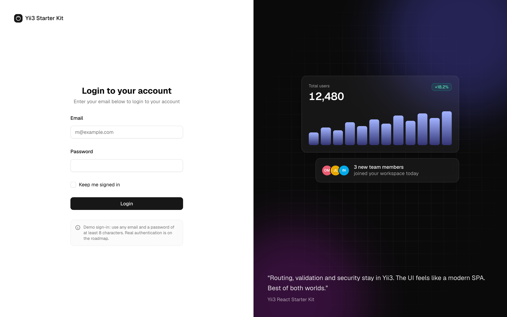
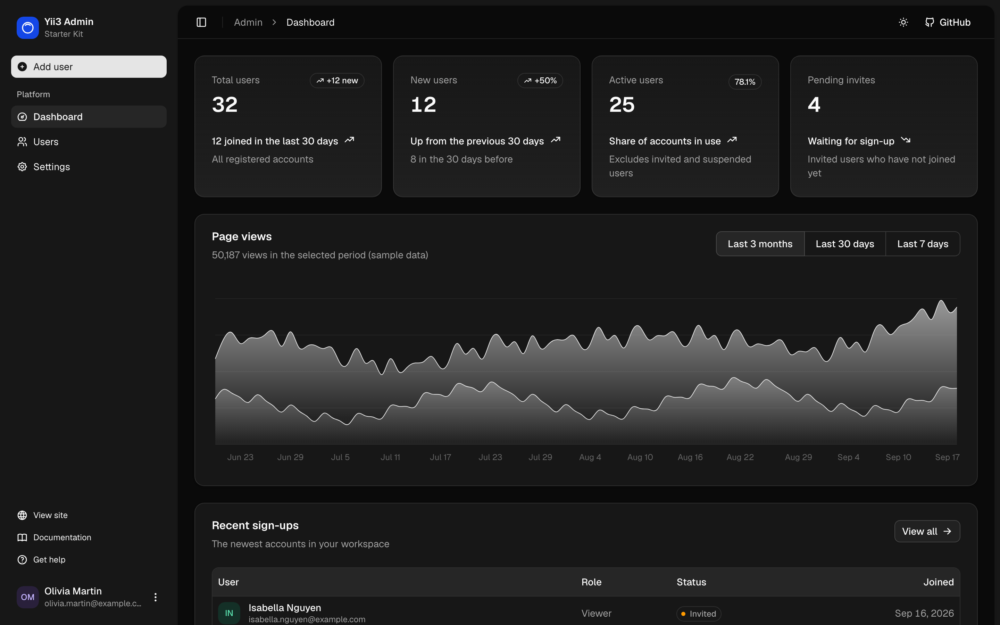
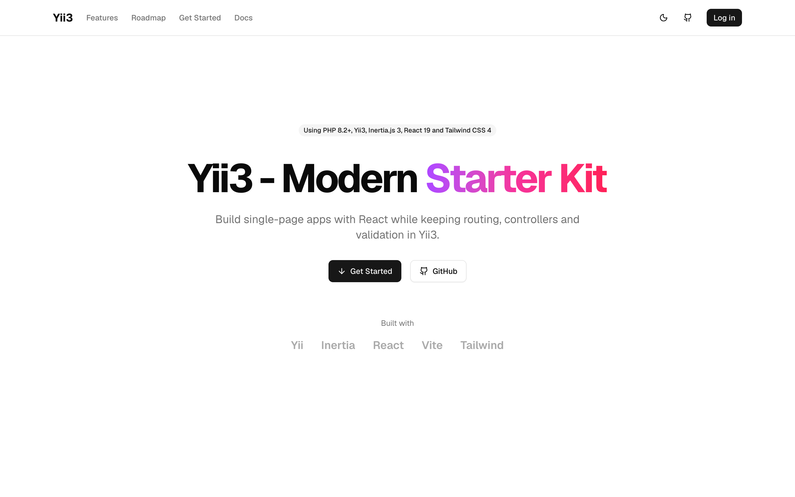

# Yii3 React Starter Kit

A starter kit for building single-page applications with Yii3, Inertia.js, React and shadcn/ui, while keeping
routing, controllers and validation in PHP.


## Screenshots

| Users | Edit user (dark theme) |
|---|---|
|  |  |

| Login | Dashboard (dark theme) |
|---|---|
|  |  |

| Settings | Landing page |
|---|---|
|  |  |

## What's included

- **Yii3 + Inertia.js 3** through [`crenspire/yii3-inertia`](https://github.com/crenspire/yii3-inertia): partial
  reloads, deferred props, validation errors, flash data and asset versioning
- **Admin dashboard** built on the shadcn/ui `dashboard-01` block: collapsible sidebar, KPI cards, an interactive
  chart, a users table with search, sorting, selection and bulk delete, and forms with server-side validation and
  toasts
- **Login page** built on the shadcn/ui `login-02` block
- **React 19** and **shadcn/ui** with light, dark and system themes
- **Tailwind CSS 4** and **Vite 8** with hot module replacement
- **CSRF protection** for Inertia requests through the `XSRF-TOKEN` cookie
- **Docker**: FrankenPHP images for development, testing and production, and a Docker Swarm stack for deploys
- **Code quality**: Psalm (level 1), PHP CS Fixer, Rector and Composer Dependency Analyser
- **Tests**: Codeception unit, functional, console and browser suites, with helpers for testing Inertia pages

> **Demo sign-in.** The kit has no user storage yet. Any email with a password of at least 8 characters signs you in,
> and admin users are kept in your session. Replace both before production, see
> [Admin area and authentication](docs/admin-and-auth.md#replacing-the-demo-with-real-users).

## Quick start

Requirements: PHP 8.2+, Composer 2, Node.js 20.19+ or 22.12+.

```bash
git clone https://github.com/crenspire/yii3-react-starter.git
cd yii3-react-starter
composer install
npm install

# In two terminals
APP_ENV=dev APP_DEBUG=true composer serve   # http://localhost:8080
npm run dev
```

Open http://localhost:8080, then go to `/login` to see the admin area.

With Docker: `make build && make up`, then run `npm run dev` on the host. See
[Getting started](docs/getting-started.md) for details.

## Documentation

| Guide | What it covers |
|---|---|
| [Getting started](docs/getting-started.md) | Installation, running locally and in Docker |
| [Architecture](docs/architecture.md) | Request flow, middleware, configuration, environment variables, project layout |
| [Pages, forms and validation](docs/pages-and-forms.md) | Adding pages, props, forms, validation errors, redirects and toasts |
| [Admin area and authentication](docs/admin-and-auth.md) | The admin shell, users, settings, and replacing the demo sign-in |
| [Frontend](docs/frontend.md) | shadcn/ui, theming, dark mode, Tailwind CSS 4 and Vite |
| [Testing and code quality](docs/testing.md) | Test suites, testing Inertia pages, Psalm, PHP CS Fixer, Rector |
| [Deployment](docs/deployment.md) | Production image, Docker Swarm, production checklist, workers |

## Tech stack

| Backend | Frontend | Tooling |
|---|---|---|
| PHP 8.2+ | React 19 | Psalm 6 |
| Yii3 | Inertia.js 3 | PHP CS Fixer |
| crenspire/yii3-inertia | shadcn/ui (Radix UI) | Rector |
| yiisoft/validator | Tailwind CSS 4 | Codeception 5 |
| FrankenPHP (Docker) | TanStack Table, Recharts | Vite 8 |

## Common commands

| Command | Description |
|---|---|
| `composer serve` | PHP development server on port 8080 (set `APP_ENV`) |
| `npm run dev` / `npm run build` | Vite dev server / production build |
| `APP_ENV=test composer test` | Run all test suites (run `npm run build` first) |
| `composer psalm` | Static analysis |
| `composer cs-check` / `composer cs-fix` | Check / fix code style |
| `composer rector` | Automated refactoring |
| `make help` | Docker targets for development, tests and deployment |

## Roadmap

Planned, and **not** part of the kit yet:

- Authentication: real user accounts with password hashing, sign up, social login and roles
- Database integration, so admin data is stored in a database instead of the session
- Payments: subscription billing
- REST API with generated documentation
- AI integration structure

## Contributing

Issues and pull requests are welcome at
[github.com/crenspire/yii3-react-starter](https://github.com/crenspire/yii3-react-starter). Please run the tests and
`composer psalm` and `composer cs-check` before opening a pull request.

## License

This project is licensed under the BSD-3-Clause license. See `composer.json`.
