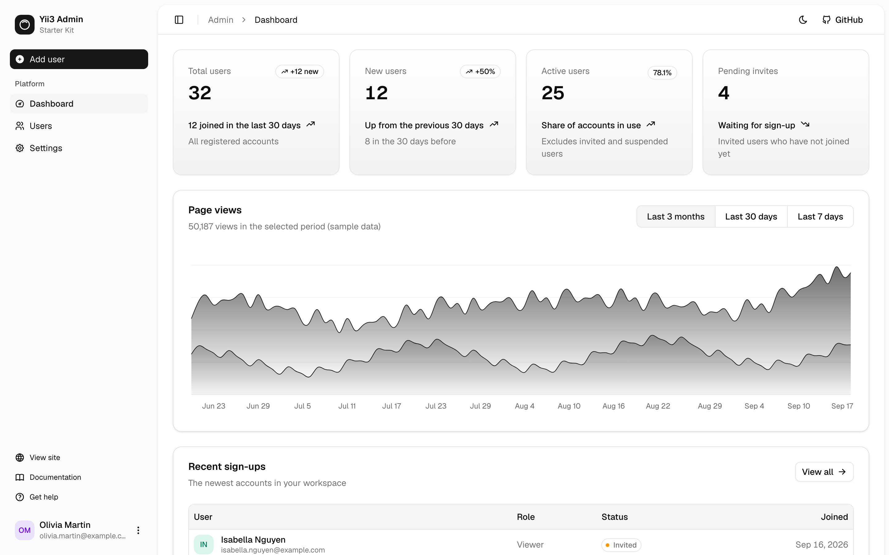
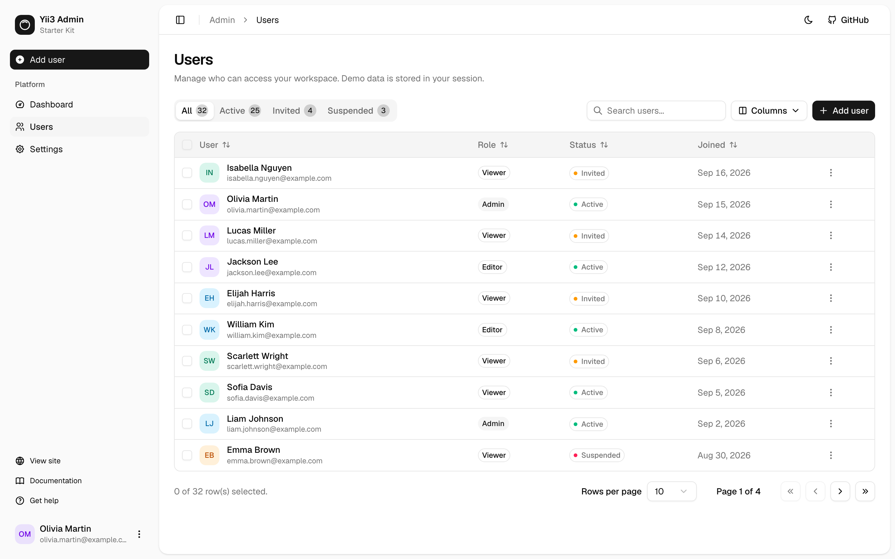
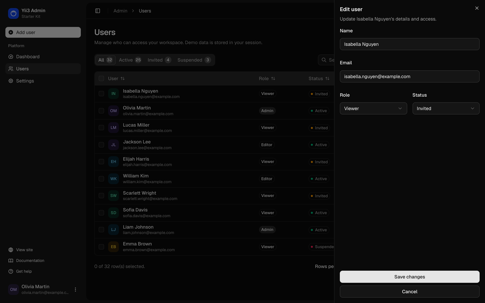
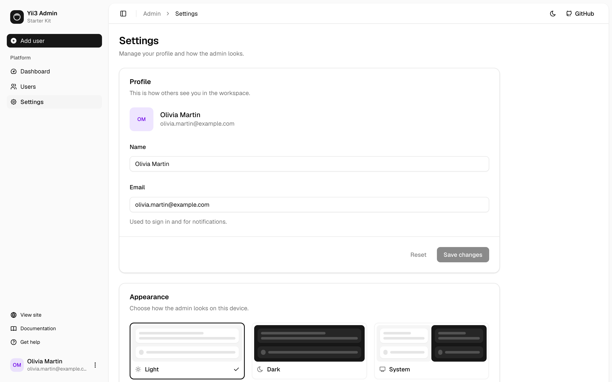

# Admin area and authentication



The admin area is built on the shadcn/ui [`dashboard-01`](https://ui.shadcn.com/blocks) block and the login page on
the `login-02` block, adapted to Inertia and wired to Yii3 actions.

| Route | Page | What it does |
|---|---|---|
| `/login` | `Auth/Login` | Sign-in form with server-side validation |
| `POST /logout` | | Ends the session |
| `/admin` | `Admin/Dashboard` | KPI cards computed from the users, a page views chart and recent sign-ups |
| `/admin/users` | `Admin/Users` | Users table with add, edit and delete |
| `/admin/settings` | `Admin/Settings` | Profile form and theme picker |

## Demo mode

> **The sign-in is a demo.** There is no user storage yet, so there are no passwords to check.

- Any email with a password of at least 8 characters signs you in. `App\Auth\AuthSession` stores the name and
  email in the session.
- `App\Admin\User\UserRepository` keeps users in the session, seeded with 32 sample users on first use. Every
  visitor gets their own copy, and it resets when the session ends.
- The page views chart on the dashboard uses generated sample data.

Real authentication and database storage are on the roadmap. Until then, **do not deploy the admin area as it is.**

## The admin shell

`assets/react/src/layouts/AdminLayout.jsx` renders the sidebar and header. Admin pages use it as a persistent
layout, so the sidebar is not re-mounted between visits:

```jsx
Dashboard.layout = (page) => <AdminLayout>{page}</AdminLayout>
```

| Part | File |
|---|---|
| Sidebar: brand, Add user button, navigation, secondary links, user menu | `components/admin/app-sidebar.jsx` |
| Navigation items | `components/admin/navigation.js` |
| Header: sidebar toggle, breadcrumbs, theme toggle, GitHub link | `components/admin/site-header.jsx` |
| User menu: account, theme, log out | `components/admin/nav-user.jsx` |

The sidebar collapses to icons with the toggle button or <kbd>Ctrl</kbd>/<kbd>⌘</kbd>+<kbd>B</kbd>, and remembers its
state in the `sidebar_state` cookie. On small screens it opens as a sheet.

## Users



`components/admin/users-table.jsx` uses [TanStack Table](https://tanstack.com/table):

- Status tabs with counts, search by name or email, sorting, column visibility and pagination
- Row selection with bulk delete
- A row menu with Edit, Copy email and Delete



Add and edit open `components/admin/user-sheet.jsx`, a side sheet with a `useForm()` form. The server validates the
input in `App\Admin\User\UserForm`, including a unique email check. Deleting asks for confirmation in
`components/admin/delete-users-dialog.jsx`.

| Action | Route |
|---|---|
| `Admin\Users\IndexAction` | `GET /admin/users` |
| `Admin\Users\StoreAction` | `POST /admin/users` |
| `Admin\Users\UpdateAction` | `PUT /admin/users/{id}` |
| `Admin\Users\DeleteAction` | `DELETE /admin/users` with `{"ids": [...]}` |

## Settings



The profile form updates the signed-in user through `PUT /admin/settings`. The appearance card sets the theme for this
device (light, dark or system) and is stored in `localStorage`.

## Access control

| Middleware | Applied to | Behavior |
|---|---|---|
| `App\Auth\RequireAuthMiddleware` | The `/admin` group | Redirects guests to `/login` |
| `App\Auth\RedirectIfAuthenticatedMiddleware` | `/login` | Redirects signed-in users to `/admin` |
| `App\Auth\ShareAuthMiddleware` | Every request | Shares `auth.user` with every page |

## Replacing the demo with real users

1. **Store users in a database.** Replace `UserRepository` with a repository backed by
   [yiisoft/db](https://github.com/yiisoft/db) or another storage, keeping the same methods, and add a migration.
2. **Check passwords.** Store hashes created with `password_hash()`. In `App\Controller\Auth\LoginAction`, look up
   the user by email and verify the password with `password_verify()`. Keep one generic error message for a wrong
   email or password, so the form does not reveal which accounts exist.
3. **Keep the user ID in the session.** Change `AuthSession` to store the user ID and load the user on each request.
   Keep the `regenerateId()` call on sign-in, which prevents session fixation.
4. **Add rate limiting** to `POST /login`.
5. **Add roles.** Check the user's role in a middleware on route groups, or use
   [yiisoft/rbac](https://github.com/yiisoft/rbac).

Remove the demo note from `pages/Auth/Login.jsx` and the "Demo data" text from `pages/Admin/Users.jsx` when you do.
